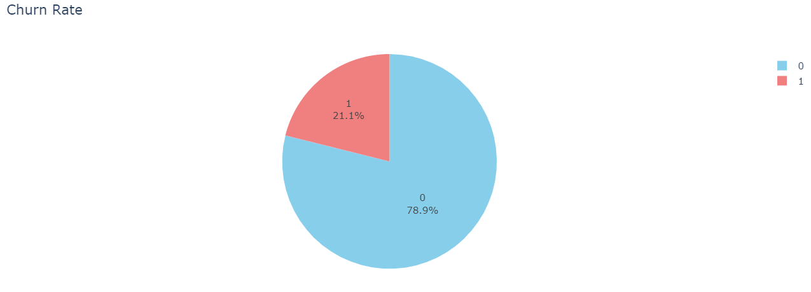
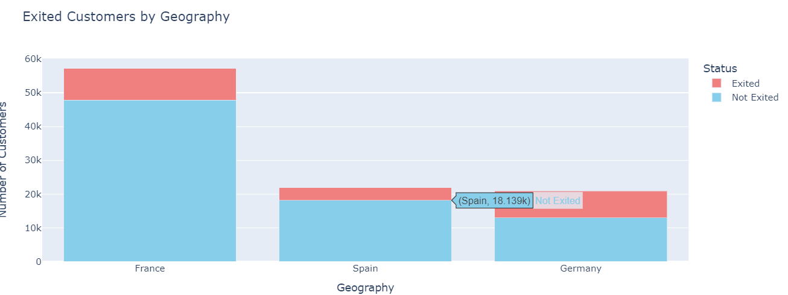
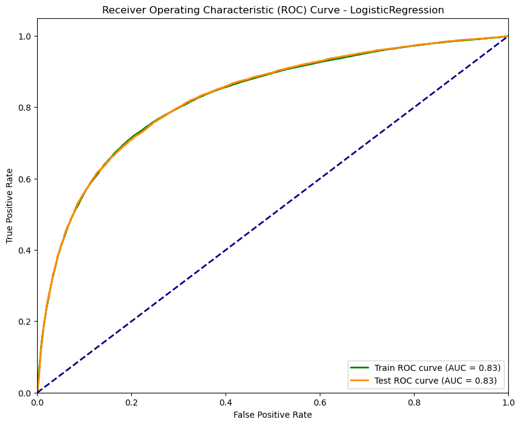
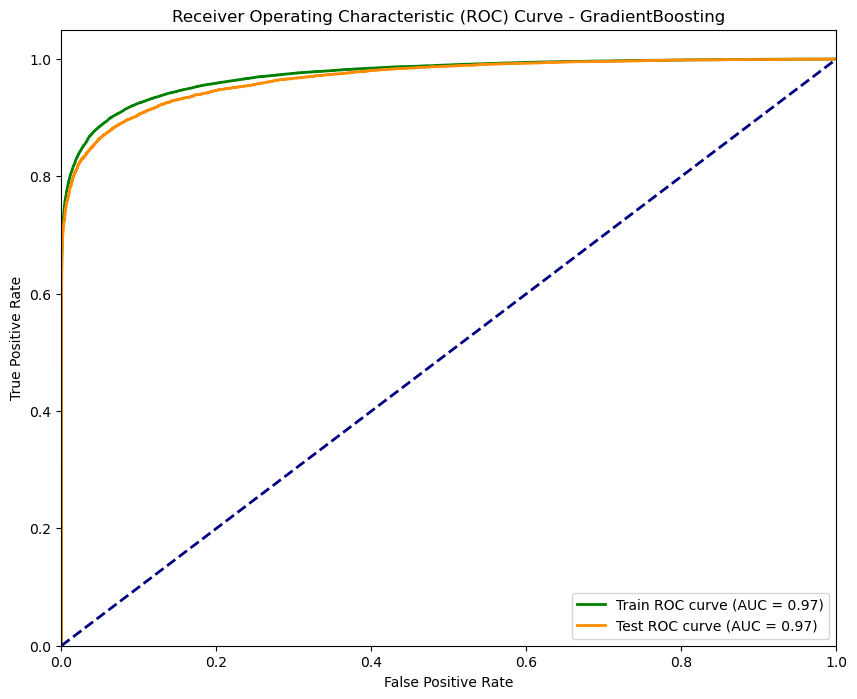

# Bank Customer Churn Prediction Model

## Overview
This repository contains code for a machine learning model that predicts customer churn for a bank. Customer churn refers to the phenomenon where customers stop doing business with a company. In the context of a bank, it means customers closing their accounts or ceasing to use banking services.

The model is built using [Python](https://www.python.org/) and popular machine learning libraries such as [scikit-learn](https://scikit-learn.org/) and classification algorithms like Logistic regression , Random forest , Decision tree , Gradient boosting and ADAboost . It leverages historical customer data to predict the likelihood of a customer churning in the future.

## Dataset

The model is trained on a dataset [Customer.csv](Dataset/Customer.csv) containing historical information about bank customers. The dataset includes various features such as customer demographics, transaction history, account balances, etc. Each entry in the dataset is labeled with whether the customer churned or not.

### Features

1. **id**: A unique identifier for each record.
2. **CustomerId**: A unique identifier for each customer.
3. **Surname**: The surname of the customer.
4. **CreditScore**: The credit score of the customer, which indicates their creditworthiness.
5. **Geography**: The geographical location of the customer.
6. **Gender**: The gender of the customer.
7. **Age**: The age of the customer.
8. **Tenure**: The number of years the customer has been with the bank.
9. **Balance**: The account balance of the customer.
10. **NumOfProducts**: The number of bank products the customer uses.
11. **HasCrCard**: Whether the customer has a credit card (1 if yes, 0 if no).
12. **IsActiveMember**: Whether the customer is an active member of the bank (1 if yes, 0 if no).
13. **EstimatedSalary**: The estimated salary of the customer.
14. **Exited**: Whether the customer has churned (1 if yes, 0 if no).

This dataset can be used to train machine learning models to predict customer churn based on the provided features. The goal is to build a model that can accurately identify customers who are likely to churn, allowing the bank to take proactive measures to retain them.

## Visualizations 

Here are some visualizations generated from the dataset:

### Churn Rate Pie Chart

*Description: This pie chart shows the distribution of churn rates among customers.*

### Exited Customers vs Geography

*Description: This visualization depicts the relationship between customer churn and geographical location.*

### Exited vs Gender

*Description: This plot illustrates the correlation between customer churn and gender.*

### AUC Curve for Logistic Regression Algorithm

*   Description: This graph represents the Area Under the Curve (AUC) for the Logistic Regression algorithm.*

### AUC Curve for Decision Tree Algorithm

*   Description: This chart displays the Area Under the Curve (AUC) for the Decision Tree algorithm.*

### AUC Curve for Gradient Boosting Algorithm

*   Description: This graph demonstrates the Area Under the Curve (AUC) for the Gradient Boosting algorithm.*
## Data Preprocessing

Before training the machine learning models, the dataset undergoes preprocessing to prepare it for analysis. Here's an overview of the preprocessing steps applied:

### Label Encoding and One-Hot Encoding

Categorical variables like 'Gender' are encoded using Label Encoding, converting them into numerical values. Additionally, to handle categorical variables with more than two categories, One-Hot Encoding is employed. This technique creates binary columns for each category, improving the model's ability to interpret categorical data.

### Feature Scaling

Feature scaling is crucial for machine learning algorithms, especially those based on distance calculations or gradient descent optimization. Two common scaling techniques are applied:

#### Min-Max Scaling

Min-Max scaling rescales features to a range between 0 and 1, preserving the distribution's shape while bringing all features to the same scale. This scaling is applied to features like 'Tenure' and 'NumOfProducts'.

#### Standard Scaling (Z-score Normalization)

Standard scaling transforms features to have a mean of 0 and a standard deviation of 1. It's particularly useful when features have different units or scales. Features such as 'CreditScore', 'Age', and 'Balance' are standardized using this technique.

### Final Preprocessed Dataset

After preprocessing, the dataset is ready for model training. Categorical variables are encoded, and numerical features are scaled to ensure all features contribute equally to model training. The preprocessed dataset is now suitable for feeding into machine learning algorithms for churn prediction.

## Model

The model employs several algorithms commonly used in binary classification tasks. Here's a brief overview of the algorithms utilized and their rationale:

### Logistic Regression

Logistic Regression is a simple yet powerful algorithm for binary classification. It's chosen for its interpretability, ease of implementation, and ability to provide probabilities for predictions. Despite its simplicity, Logistic Regression can capture linear relationships between features and the target variable.

### Random Forest

Random Forest is an ensemble learning technique that constructs multiple decision trees during training and outputs the mode of the classes (classification) or the mean prediction (regression) of the individual trees. It's known for its robustness to overfitting, handling of high-dimensional datasets, and feature importance estimation.

### Decision Tree

Decision Tree is a non-parametric supervised learning method used for classification and regression. It works by recursively partitioning the input space into regions based on feature values, with the goal of maximizing the homogeneity of the target variable within each region. Decision Trees are easy to interpret and visualize, making them valuable for understanding feature importance.

### Gradient Boosting

Gradient Boosting is an ensemble learning technique that builds models sequentially, with each new model correcting errors made by the previous ones. It combines weak learners (usually decision trees) to create a strong learner. Gradient Boosting is effective in capturing complex relationships in the data and has been successful in various machine learning competitions.

### AdaBoost

AdaBoost (Adaptive Boosting) is another ensemble learning method that combines multiple weak learners to form a strong classifier. It assigns higher weights to misclassified data points in each iteration, allowing subsequent weak learners to focus on the difficult examples. AdaBoost is particularly useful when dealing with imbalanced datasets and noisy data.

These algorithms are chosen for their complementary strengths in handling different aspects of the dataset and their proven effectiveness in classification tasks. By employing a diverse set of algorithms, we aim to build a robust model capable of accurately predicting customer churn and providing valuable insights for retention strategies.

## Usage
To use the model, follow these steps:
1. Clone this repository to your local machine.
2. Install the required dependencies listed in the `requirements.txt` file.
3. Run the provided Jupyter notebook or Python script to train the model on your dataset.
4. Once trained, you can use the model to make predictions on new data by providing the relevant features as input.

## Evaluation
The model's performance can be evaluated using various metrics such as accuracy, precision, recall, and F1-score. Additionally, you can visualize the model's performance using techniques such as confusion matrices and ROC curves.

## Contributors
- [Your Name](https://github.com/yourusername) - Role/Contribution

## License
This project is licensed under the [MIT License](LICENSE).
