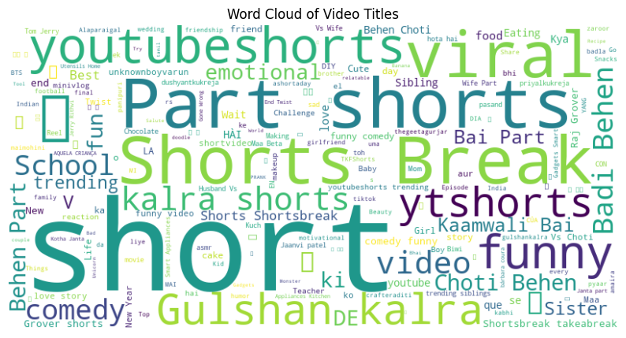
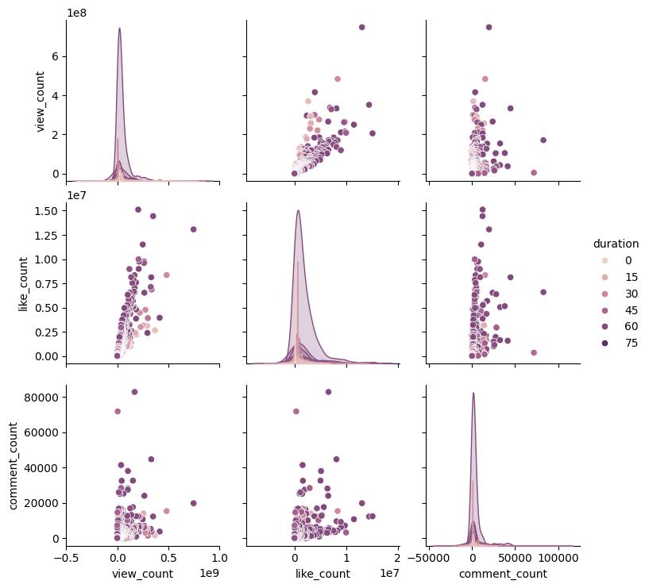
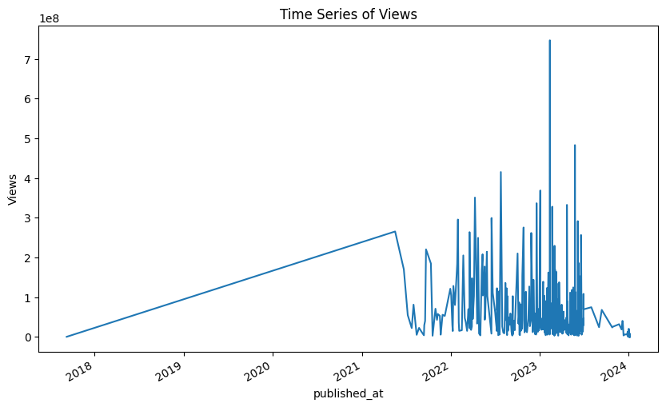

# VIRAL VIDEO SHORTS ANALYSIS

### Aim : The aim of this project is to analyze the viral videos based on the given dataset.

### Data Set : https://www.kaggle.com/datasets/kanchana1990/viral-shorts-youtubes-most-viewed

### Work Done : 
- Analyzed the data and removed those rows having any NULL cell.
- Plotted graphs to analyze the extract of the data.
- Lastly tries to predict Number of Likes in viral shorts with the use of features, these features include columns = 'duration', 'year', 'month', 'day', 'comment_count', 'view_count' .

### Library used :
- Pandas
- Numpy
- Natural Language Toolkit
- String
- Matplotlib
- Seaborn
- Word cloud
- Scikit learn

### Visual plots :

### Model used:
* Linear Regression
* Decision Tree Regressor
* Random Forest Regressor
* Gradient Boosting Regressor
* Support Vector Regressor
* Multi-layer Perceptron Regressor
* k-Nearest Neighbors Regressor

### Evaluation Result :
- Test Data Results

| Model                             |Root Mean Square error|    R2 Score      |
|-----------------------------------|----------------------|------------------|
| Linear Regression                 | 1,749,841.770        |     0.510        |
| Decision Tree Regressor           | 1,434,585.424        |     0.671        |
| Random Forest Regressor           | 1,242,172.244        |     0.753        |
| Gradient Boosting Regressor       | 1,456,313.340        |     0.661        |
| Support Vector Regressor          | 2,738,273.404        |    -0.199        |
| Multi-layer Perceptron Regressor  | 1,799,060.980        |     0.483        |
| k-Nearest Neighbors Regressor     | 1,582,670.343        |     0.600        |

- Train Data Results

| Model                             |Root Mean Square error|    R2 Score       |
|-----------------------------------|----------------------|-------------------|
| Linear Regression                 |    979,192.253       |      0.758        |
| Decision Tree Regressor           |          0.0         |      1.0          |
| Random Forest Regressor           |    300,353.851       |      0.977        |
| Gradient Boosting Regressor       |    282,346.501       |      0.980        |
| Support Vector Regressor          |  2,111,086.453       |     -0.126        |
| Multi-layer Perceptron Regressor  |  1,201,344.870       |      0.635        |
| k-Nearest Neighbors Regressor     |    928,265.630       |      0.782        |

### Conclusion :
- From given results Random Forest Regressor is best fitted for it.
- With Train set R2 Score of Decision Tree Regressor was perfect while Random Tree Regressor has more than 97% accuracy.

### Contributor : 
 *Harsh Raj*
 
 *Abhishek Sharma* (Mentor)

### Connect with me:
 

